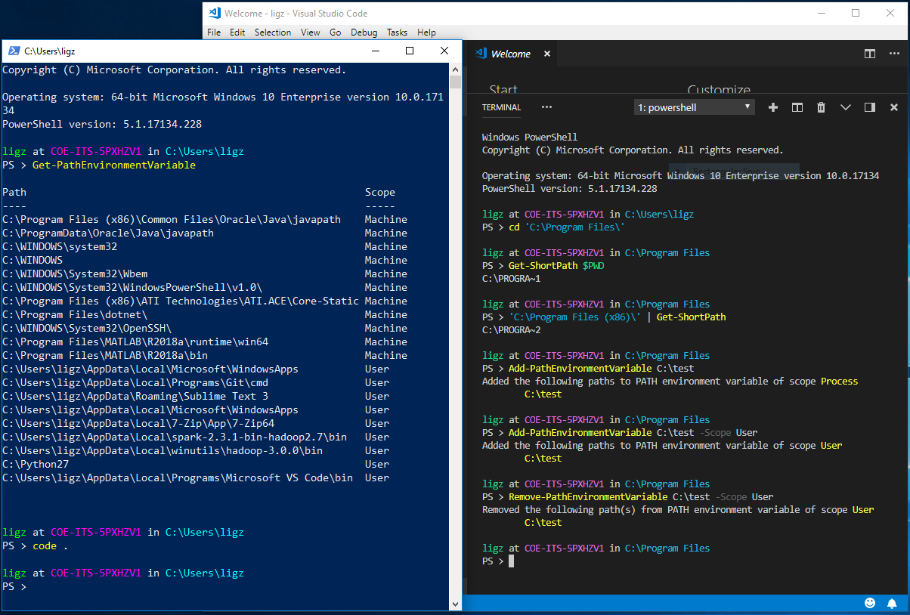

# Guozhen's Windows PowerShell Profile


## What Is This
A [PowerShell profile](https://docs.microsoft.com/en-us/powershell/module/microsoft.powershell.core/about/about_profiles) is a script that runs every time you start a PowerShell session, such as a PowerShell console, or an integrated scripting environment (ISE). It is PowerShell's equivalent to `.bash_profile` and `.bashrc` files of the Bash shell. It's a place where you can customize your shell environment and pre-load frequently used functions/commands/variables.

This repository includes my PowerShell profile scripts, including customizing the command line prompt, and useful functions like `Test-Administrator` and `Set-PathEnvironmentVariable`.

The script is only tested on Windows 10 and Windows Server 2012 R2 with PowerShell 5.1. Please use caution when using it on other versions of Windows and PowerShell. Please do not use it on other operating systems.

## How To Use

### Option 1: Download the profile scripts directly to your local PowerShell profile location
You can download my PowerShell-Profile scripts directly to your local machine's PowerShell profile location. 
Run the following script In a PowerShell console:
```powershell
$dest = $PROFILE.CurrentUserAllHosts
if (-not (Test-Path $dest)) {New-Item $dest -Type File -Force }
Split-Path $dest | Push-Location
Start-BitsTransfer https://raw.githubusercontent.com/ligz08/PowerShell-Profile/master/psfunctions.ps1
Start-BitsTransfer https://raw.githubusercontent.com/ligz08/PowerShell-Profile/master/profile.ps1
Pop-Location
. $dest
```

Note: the last command `. $dest` may induce an error that has to do with "Execution Policies". If this occurs, run the following commands to allow the profile scripts to run. For more details about PowerShell execution policies, see [About Execution Policies](https://docs.microsoft.com/en-us/powershell/module/microsoft.powershell.core/about/about_execution_policies).

```powershell
Set-ExecutionPolicy -ExecutionPolicy RemoteSigned -Scope CurrentUser
. $dest
```

### Option 2: Clone/download repository to local machine
Or, fork, clone or download this repository if you want more tweaking and customization.
When on a local machine, copy all `.ps1` files to your PowerShell profile directory. For example:
```powershell
Copy-Item .\*.ps1 (Split-Path $PROFILE.CurrentUserAllHosts)
```

## More Explanations
### Current user vs. all users
A profile script for "current user" is effective only for you. Not for anyone else who use a different account to log into the same machine. It is recommended to apply a profile script only for yourself (current user).

### Current host vs. all hosts
A host is an application that makes calls to the PowerShell engine, and shows outputs to you. Your Windows typically has only one PowerShell core, but can have muliple hosts, for example, the PowerShell console is one, the PowerShell ISE (integrated scripting environment) is another, and the PowerShell Integrated Console in your Visual Studio Code is yet another different host. 
If you run `Get-Host` you can see what host you're running PowerShell from.

To make different hosts behave differently, you may want to specify different profile scripts for them. Run `$PROFILE.CurretUserCurrentHost` to see where PowerShell looks for profile script for your current host.

## TODOs
- [ ] `Reload-Profile` function
- [ ] Help blocks & documentations for functions
- [ ] Git repository status in prompt

## References & Links
- This work is inspired by and borrows a lot of insights from [Mathias Bynens](https://mathiasbynens.be/)' dotfiles for macOS: https://github.com/mathiasbynens/dotfiles
- About PowerShell Profiles: https://docs.microsoft.com/en-us/powershell/module/microsoft.powershell.core/about/about_profiles
- `Test-Administrator` function: https://serverfault.com/a/97599
